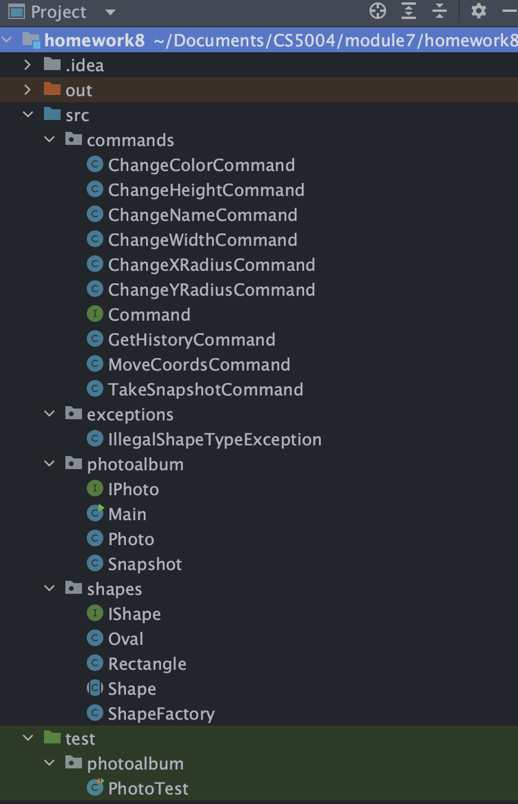
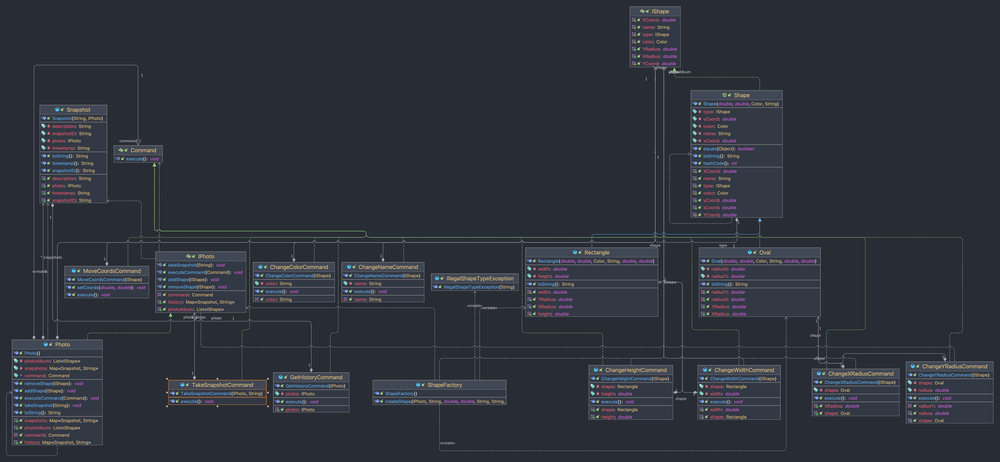
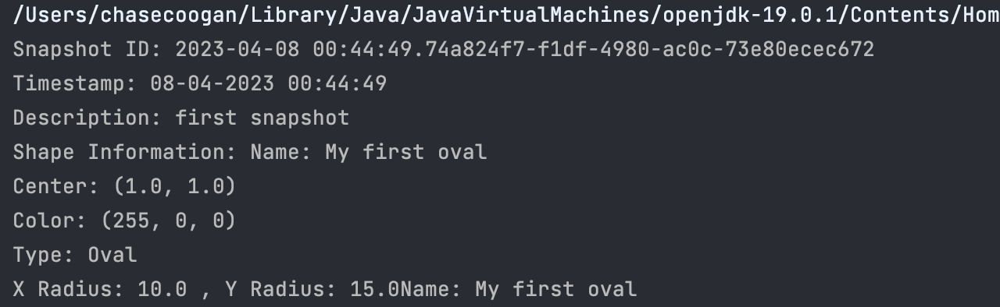

# Homework 8 - MVC - Model
 

Name: Chase Coogan\
Semeser: Spring 2023\
Class: CS 5004\
Github: https://github.com/cwcoogan\
___
## Project Outline:
This project explores the _Model_ principle within the MVC design pattern and explores how creating various different shapes can be encapsulated to promote less code-reuse, safer code pratices, and gatekeep different components that do not need to be client facing as well as stay hidden from different components of the MVC model. Part 1 of the project explores creating a photoalbum and storing different shapes to it that each contain various methods such as;  it's name; type, color, radius, and coordinates. The photoalbum has different functionality such as; adding and removing shapes, as well as taking snapshots of it's current state. Through various encapsulation practices, I will outline  my design below.
___ 
## Design Pattern:
This project follows the MVC model, as well as has integration with different design patterns such as the Command Pattern, and the Factory Pattern. File structure displayed below:

 

  
My file structure is broken up into various packages depending on their Design Pattern. The commands package follows the Command Design Pattern. The Command Design Pattern allows my application to encapsulate requests between the client and receiver. The way it works is by integrating an Interface which each ConcreteCommand class inherits to invoke various methods, allowing deeper encapsulation. Within my shapes package, I take advantage of the Factory Design Pattern by implementing a ShapeFactory. The ShapeFactory is responsible for instantiating new shapes based on the inputs. The Factory Pattern communicates with the Command Pattern through the ConcreteCommands. When a new shape is created and stored in a photoalbum, my application can then execute these commands. Finally, my Model is the photoalbum class. This class is responsible for the physical storage, and manipulation of the data. The data being stored, and modified is the object and it's state.
 
 
___ 
# Links to code:
* [Commands Package](src/commands)
* [Shapes Package](src/shapes)
* [Photoalbum Class](src/photoalbum.java)
* [exceptions Package](src/exceptions)
* [UML Diagram](UML.png)
* [Snapshot Output](snapshot.png)
___ 
## UML Diagram:

___
## Snapshot output photo:
* This image displays the output to the terminal of the snapshot and all of it's data.

        

