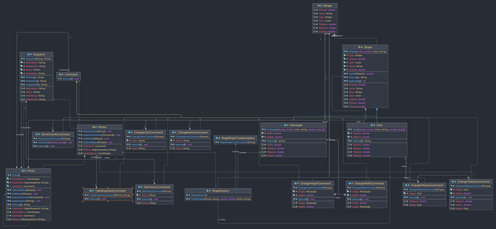
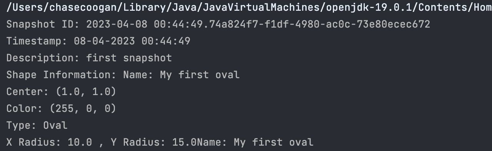

# Homework 8 - MVC - Model
 

Name: Chase Coogan\
Semeser: Spring 2023\
Class: CS 5004\
Github: [Project Link (repo private may not work)](https://github.com/cwcoogan/homework8)
___
## Project Outline:
This project explores the _Model_ principle within the MVC design pattern. For the Model, I decided to store all objects and snapshots in a Hashmap. Using a Hashmap allows my application to iterate between different states of the shape based on the <K,V> pair stored in the Model. I explore various different Design Patterns that will be discussed below. My model is stored in the [Model package](src/Model). To preface, the design patterns I implemented are as follows:

* Model-View-Controller Design Pattern
* Command Design Pattern
* Factory Design Pattern

These Design Patterns allow my application to have deeper encapsulation, and allows my Model to only have access to the Commands it needs to execute the methods appropriately. This approach allows my Model to focus on it's sole job: storing and managing the data in it's various states.
___ 
## Design Pattern:
This project follows the MVC model, as well as has integration with different design patterns such as the Command Pattern, and the Factory Pattern. File structure displayed below:

 

  
My file structure is broken up into various packages depending on their Design Pattern. The commands package follows the Command Design Pattern. The Command Design Pattern allows my application to encapsulate requests between the client and receiver within Command Objects. The way it works is by integrating an Interface which each ConcreteCommand class inherits to invoke various methods, allowing deeper encapsulation. Within my shapes package, I take advantage of the Factory Design Pattern by implementing a ShapeFactory. The ShapeFactory is responsible for instantiating new shapes based on the inputs. The Factory Pattern communicates with the Command Pattern through the ConcreteCommands. When a new shape is created and stored in a Model, my application can then execute these commands. The Model package is my model and is responsible for the storage and manipulation of the data. The data being stored and modified is the object and it's state(s).
 
 
___ 

## UML Diagram:

___
## Snapshot output photo:
* This image displays the output to the terminal of the snapshot and all of it's data.

___
## How to run:
1. Clone the repository to your local machine.
2. Open the project in your IDE of choice.
3. Run the [Main.java](src/Model/Main.java) file.
4. If the Main does not exist-- create the Main & instantiate a Photo, IShape, and ShapeFactory class. Utilize the [commands package](src/commands) to create the commands you want to execute. 
___ 
## Links to code:
* [Commands Package](src/commands)
* [Shapes Package](src/shapes)
* [Photoalbum Class](src/Model)
* [exceptions Package](src/exceptions)
* [UML Diagram](src/images/UML.png)
* [Snapshot Output](src/images/snapshot.png)
___ 

        

