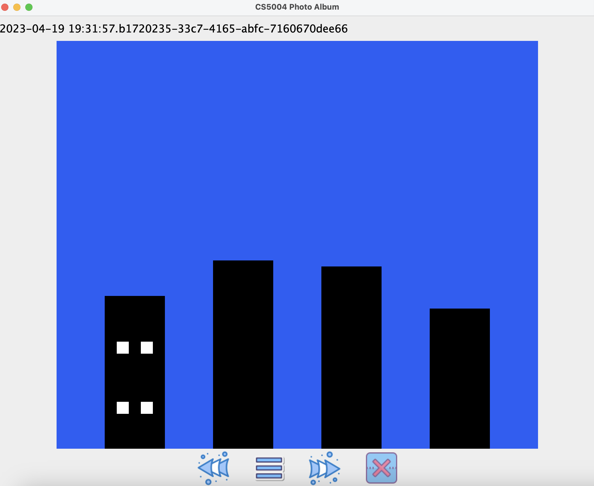
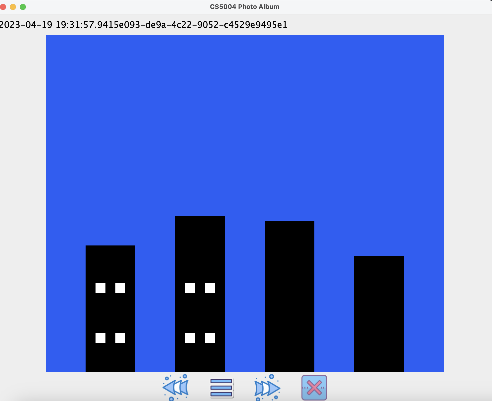

# Homework 9 - Shapes Photo Album pt 2: Controller & Views
 


Name: Chase Coogan\
Semester: Spring 2023\
Class: CS 5004\
Github: [Project Link (repo private may not work)](https://github.com/cwcoogan/homework9)
___
## Project Outline:                         
This project explores the _Controller_ and _View_ principles within the MVC design pattern. For this project, I created two views: one GUI built with Java Swing and the second a static HTML page. My Controller acts as the mediator between each view, and the Model. The Controller is stored in [Controller Package](src/Controller) and the View(s) are stored in [View Packages](src/View).

I continued to work with the same Design Patterns from Part 1 of the project:

* Model-View-Controller Design Pattern
* Command Design Pattern
* Factory Design Pattern

I found that these Design Patterns allow my application to have deeper encapsulation, and allows my Model, Controller, and Views to only have access to the Commands they need to execute the application appropriately. This approach allows my Model to focus on it's sole job: storing and managing the data in it's various states. My Controller is able to focus on mediating between the Model and the View, and it allows my view to focus on displaying the data and application to the client. I found the interconnection between each principle to be within the Controller where I am able to actually manipulate the data being passed around and execute commands and update the Model appropriately.
___ 
## Design Pattern:
This project follows the MVC model, as well as has integration with different design patterns such as the Command Pattern, and the Factory Pattern. File structure displayed below:

<br/>


  
My file structure is broken up into various packages depending on their Design Pattern. The commands package follows the Command Design Pattern. The Command Design Pattern allows my application to encapsulate requests between the client and receiver within Command Objects. The way it works is by integrating an Interface which each ConcreteCommand class inherits to invoke various methods, allowing deeper encapsulation. Within my shapes package, I take advantage of the Factory Design Pattern by implementing a ShapeFactory. The ShapeFactory is responsible for instantiating new shapes based on the inputs. The Factory Pattern communicates with the Command Pattern through the ConcreteCommands. When a new shape is created and stored in a Model, my application can then execute these commands. The Model package is my model and is responsible for the storage and manipulation of the data. The data being stored and modified is the object and it's state(s).
<br clear="left"/>
<br/>
___ 

## UML Diagram:


___
## Snapshot output photo:
* The following images showcase each Snapshot state of the Model, displayed through the View.

<style>
  .image-row {
    display: flex;
    flex-wrap: wrap;
    margin-bottom: 10px; /* Add margin between rows */
  }

  .image-row img {
    max-width: 250px; /* Set max width for images */
    max-height: 250px; /* Set max height for images */
    margin-right: 10px; /* Add margin between images */
  }
</style>

<!-- First row of images -->
<div class="image-row">
  
  
  
</div>

<!-- Second row of images -->
<div class="image-row">
  
  
</div>

___
## How to run (JAR):
1. Clone the repository to your local machine.
2. Open the project in your IDE of choice.
3. Navigate to the [resources folder](src/resources) that contains the .jar file  
4. In the CLI run the command ```java -jar homework8.jar -in buildings.txt -out /User/chasecoogan/Documents/module7/homework8/src/resources.html - view web ```
5. Navigate to the [resources folder](src/resources) and open the .html file to view the output.
___ 
## Links to code:
* [Model Package](src/Model)
* [View Package](src/View)
* [Controller Package](src/Controller)
* [Commands Package](src/commands)
* [Shapes Package](src/shapes)
* [resources folder](src/resources)
* [exceptions Package](src/exceptions)

___ 

        


