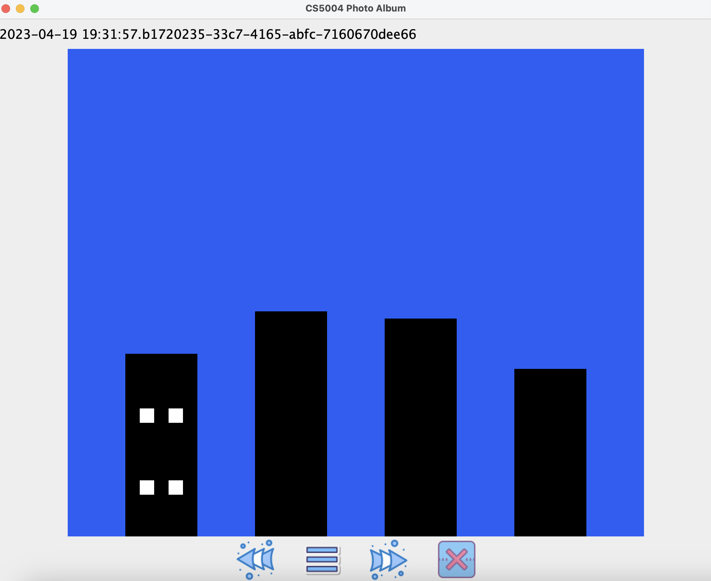
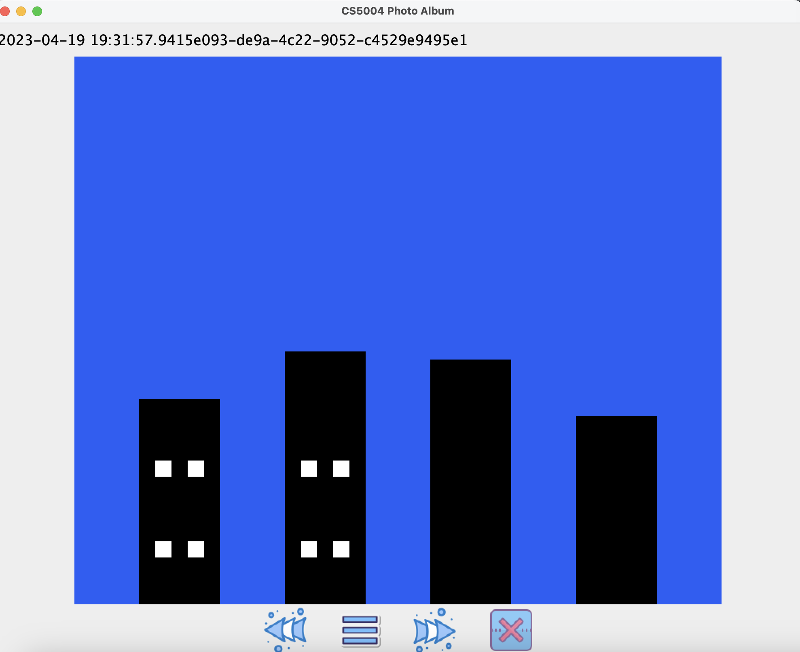
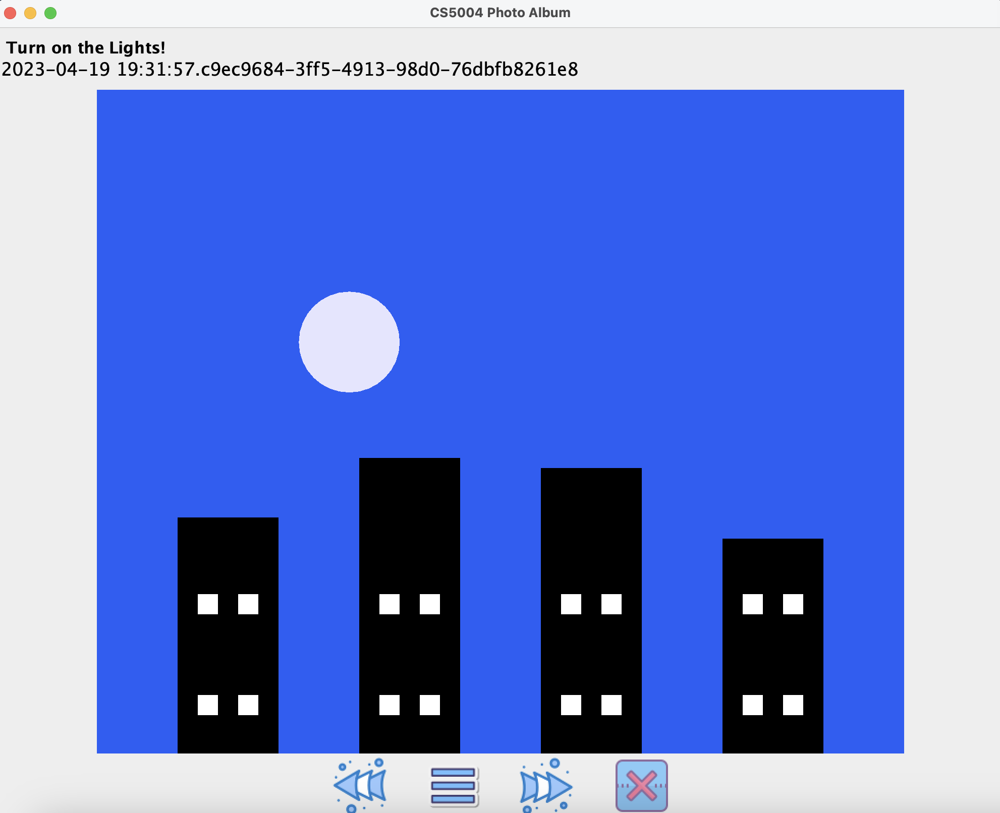
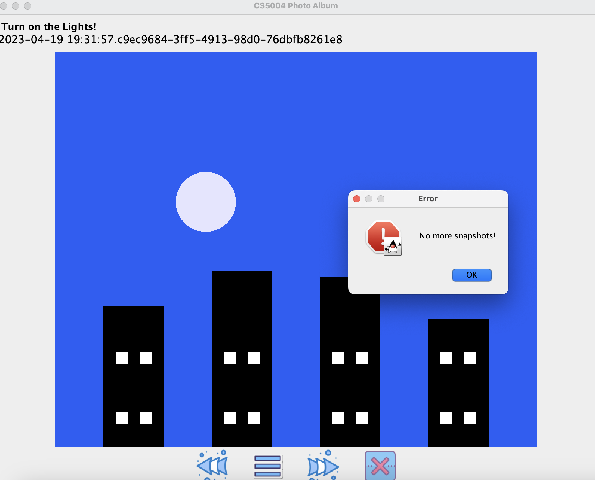
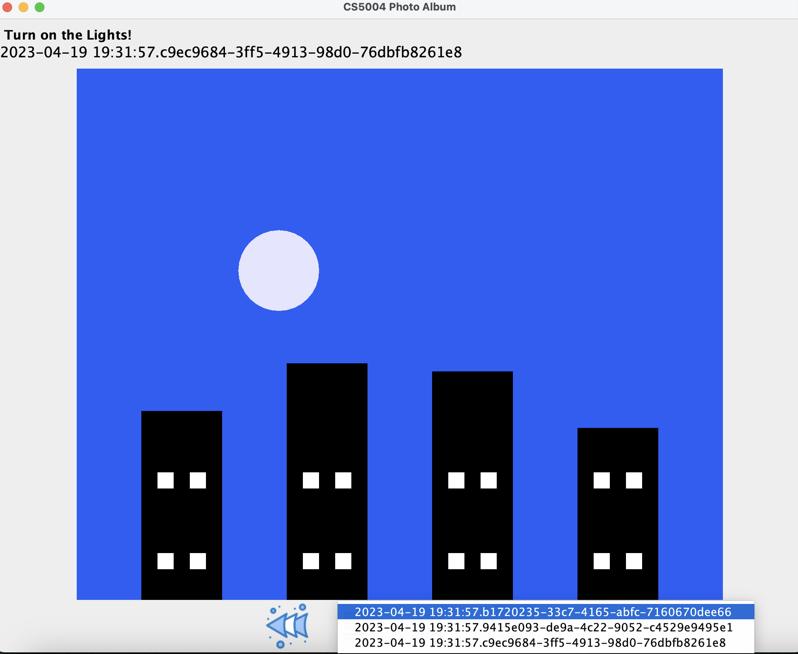
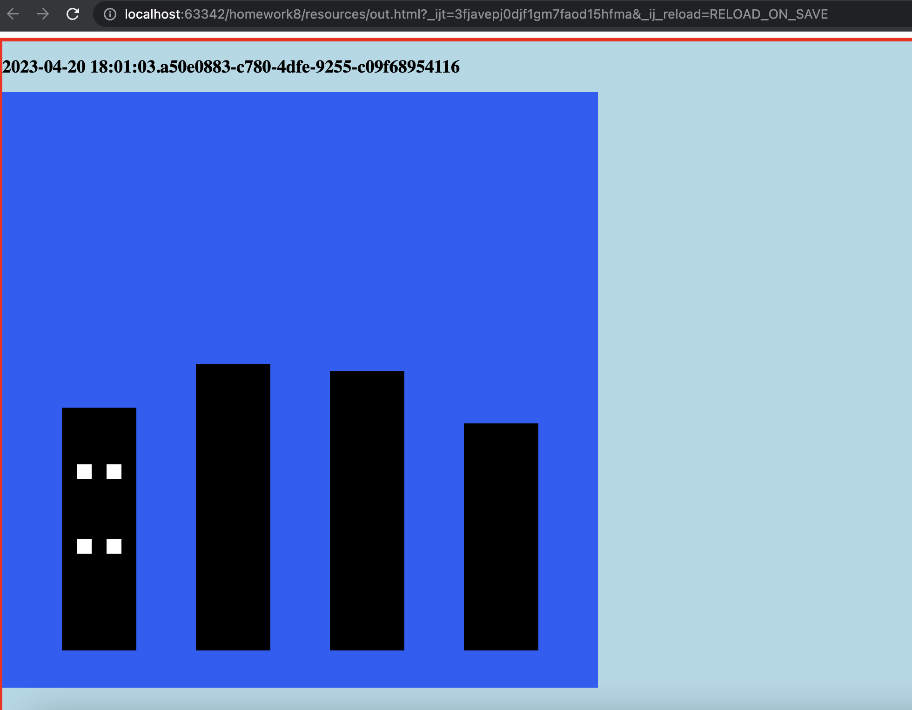
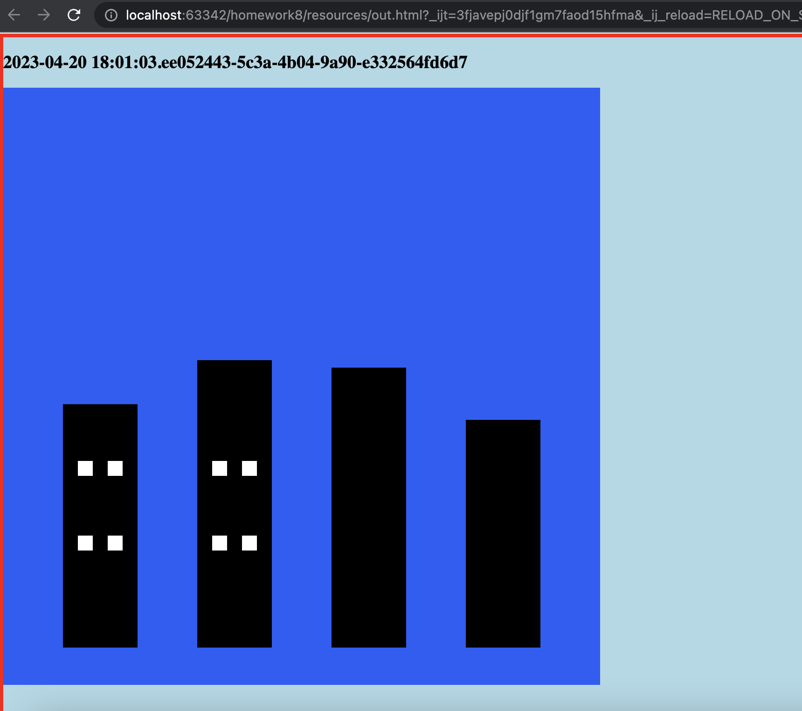
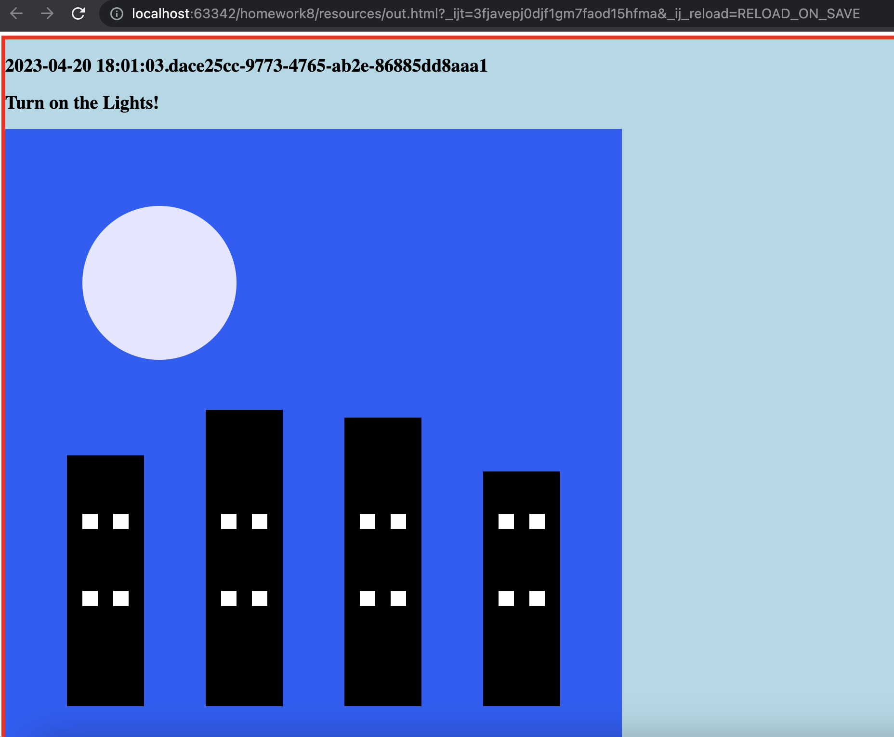

# Homework 9 - Shapes Photo Album pt 2: Controller & Views
 


Name: Chase Coogan\
Semester: Spring 2023\
Class: CS 5004\
Github: [Project Link (repo private may not work)](https://github.com/cwcoogan/homework9)
___
## Project Outline:                         
This project explores the _Controller_ and _View_ principles within the MVC design pattern. For this project, I created two views: a graphical interface built with Java Swing and the  a static HTML page. My Controller acts as the mediator between each view, and the Model. The Controller is stored in [Controller Package](../Controller) and the View(s) are stored in [View Packages](../View).

I continued to work with the same Design Patterns from Part 1 of the project:

* Model-View-Controller Design Pattern
* Command Design Pattern
* Factory Design Pattern

I found that these Design Patterns allow my application to have deeper encapsulation, and allows my Model, Controller, and Views to have access to the Commands they need to execute the application appropriately. This approach allows my Model to focus on it's sole job: storing and managing the data in it's various states. My Controller is able to focus on mediating between the Model and the View, and it allows my view to focus on displaying the data and application to the client. I found the interconnection between each principle to be within the Controller, where the user sends a request via command line which gets processed by the Controller and the request is then sent to the Model and output by the View.
___ 
## Project Updates:

From Part 1 to Part 2, I added the following features:
* Added a Controller to mediate between the Model and the View(s)
* Added a GUI View built with Java Swing
* Added a static HTML View
* Added feature to Parse File Data
* Added Command Line Arguments 

I continued to follow the MVC, Command and Factory Design Pattern. My file structure is broken up by each respective Design Pattern. I have files for each principle across the MVC principle (Model/View/Controller Packages), I have a package [commands](../commands) that follows the Command Design Pattern and I have a package [Shapes](../shapes) that follows the Factory Design Pattern. 

My [Controller](../Controller) is the interlinking between the [Model](../Model) and the [View](../View). On the graphical interface, my controller acts as the point of contact for executing the Snapshots that are sent to the View. If a user selects a snapshot, returns to the previous snapshot, or goes to the next snapshot- my Model will receive this request and then the View will display it accordingly. My Controller acts as the main point of contact where the command line arguments are processed. When users pass arguments into the CLI, the controller processes these requests, and determines if they are valid, and if so it will send the request to retrieve the data from the Model and then activate the correct view to display.

___
## GUI Snapshot photos:
* The following images showcase each Snapshot state of the Model, displayed through the GUI View.

<!-- Create a table for the first row with 3 columns -->
<table>
  <tr>
    <td style="padding: 10px;"></td>
    <td style="padding: 10px;"></td>
    <td style="padding: 10px;"></td>
  </tr>
</table>
<!-- Create a table for the second row with 2 columns -->
<table>
  <tr>
    <td style="padding: 10px;"></td>
    <td style="padding: 10px;"></td>
  </tr>
</table>

___
## Static Web Snapshot photos:
* The following images showcase each Snapshot state of the Model, displayed through the static HTML View rendered on my local host.
<!-- Create a table for the first row with 3 columns -->
<table>
  <tr>
    <td style="padding: 10px;"></td>
    <td style="padding: 10px;"></td>
    <td style="padding: 10px;"></td>
  </tr>
</table>

___
## How to run (JAR):
1. Clone the repository to your local machine.
2. Open the project in your IDE of choice.
4. RUN static view with: ```java -jar src/resources/homework8.jar -in src/resources/buildings.txt -out [Your output file path] -view web ```
4. RUN graphical view with: ```java -jar src/resources/homework8.jar -in src/resources/buildings.txt -view graphical 800 800```
5. Navigate to the [resources folder](../resources) and right click open the .html file to view the output in a browser of your choice
___ 
## Links to code:
* [Model Package](../Model)
* [View Package](../View)
* [Controller Package](../Controller)
* [Commands Package](../commands)
* [Shapes Package](../shapes)
* [resources folder](../resources)
* [exceptions Package](../exceptions)

___ 

        


